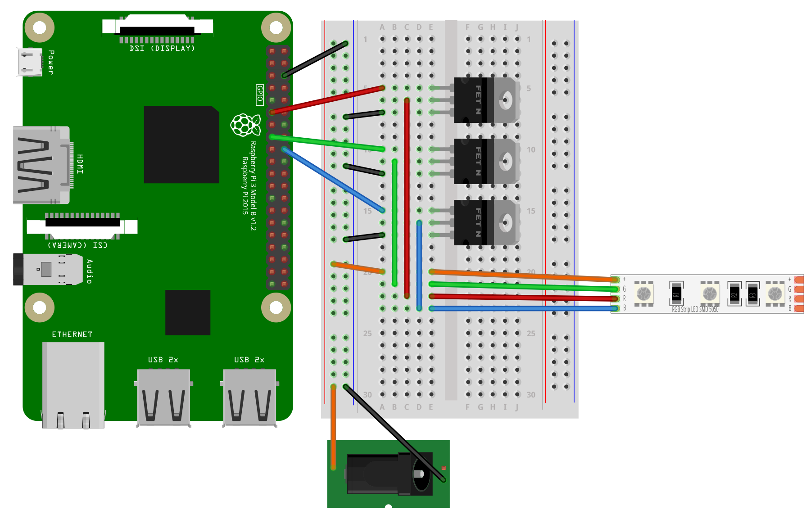
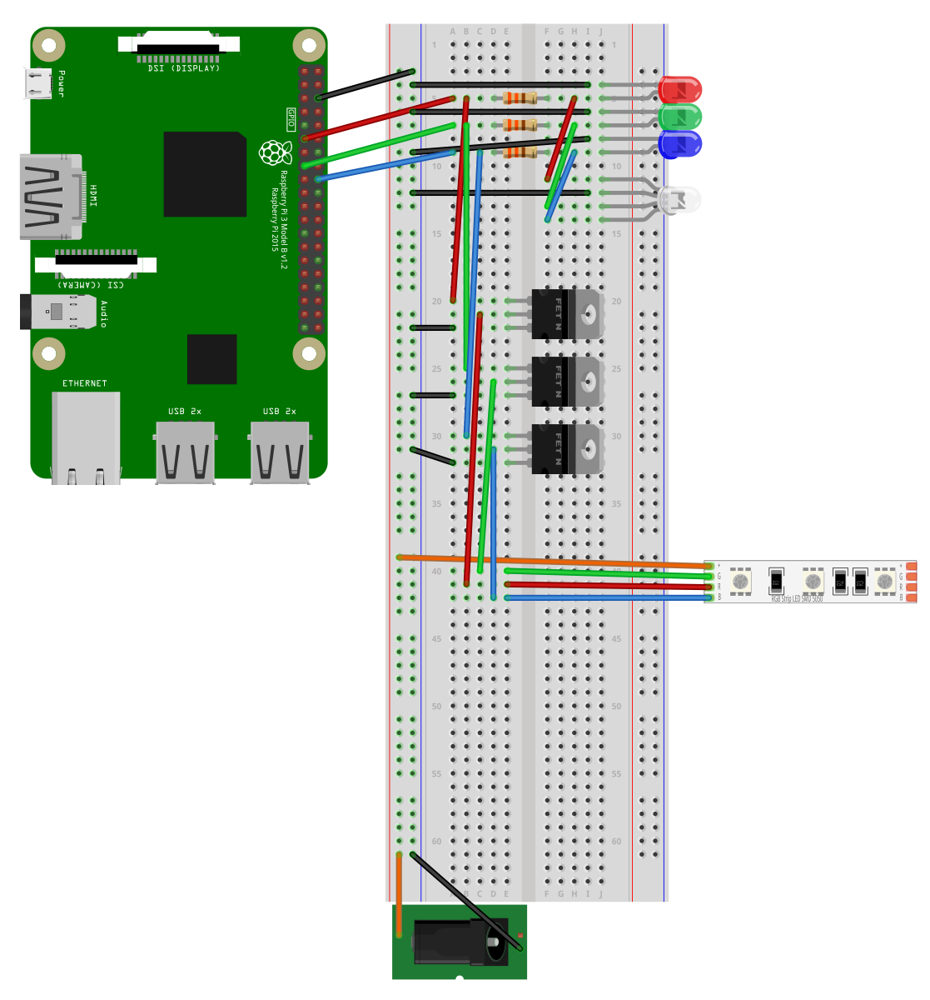

# Node.js Raspbery Pi Server
###### A Node.js website that carries out Python scripts on a Raspberry Pi on specific GET requests
###### Version 0.5 (UNFINISHED)
---

## About this Project

This project is a test of running a Python script using Node.js to trigger it.

The python scripts are used to manipulate the connected 12v RGB Strip (See the wiring diagram in 'Setting up the breadboard')

## How to use it

#### Installing Dependencys

Assuming you are installing this project from a fresh install of Raspberry Pi OS, the following will take you through installing all of the dependencys I used.
The version of Raspberry Pi OS i use is the `Lite` version which comes un-bloated, depending on what version you use, it might come with `node`/`node.js` installed already. Check what version of these dependencys you are using otherwise they may be out of date or conflict.

##### node.js

You can download and install the most recent version of `node.js` using:

`sudo apt-get install nodejs`

Assuming you have no errors, you should be able to check what version you have using:

`node -v`

##### npm

`npm` is a package manager for Node to easily install and use dependencys for JavaScript programs.

You can download and install the most recent version of `npm` using:

`curl -L https://npmjs.org/install.sh | sudo sh`

`npm -v`

##### git

Clone this repository to your Pi so that you can use and play around with the code.

Install `git` using:

`sudo apt-get install git`

To download this repository use:

`git clone https://github.com/LukeTHadley/Raspberry-Pi-RGB-Strip-Remote.git`

#### Setting up the breadboard

The circuit to wire up the Raspberry Pi to a 12v RGB strip is simple. All you will need are the following components and to follow the diagram below:

* A Breadboard
* 3 N Channel Mosfets ()
* Some patch cables
* A barrel jack converter

But if, like me, you want to be a bit more fancy, you might want to add individual LED's to your breadboard so that you can see what each colour is doing, and have a single indicator LED for what the entire strip should be doing.

Having this extra circuit also means that you can still program more Python scripts for the LED's without having to have the RGB Strip or 12v power plugged in, giving you an indication like so:

To do this, you will need a red, green, blue, and RGB LED. It is also advisable to use some resistors with these LED's, the ones I used are 330ohm resistors.

In case you have a hard time following the circuit diagrams, the `Fritzing` files are in `./readme_resources/`, or, see the image of the entire circuit below.

#### Starting the Service and Connecting to it

##### Getting your IP

You will need to know the IP of your Raspberry Pi so that you can connect to it via a browser, you can find this out by running the command:

`hostname -I`

##### Starting the Node.js Service

Navigate to where ever you downloaded the repository, and navigate to `/node-led/` and run the command:

`node index.js` to start the node service.

Once it has fully started, unless there are any errors, it should output:

`Starting Node.js server, listening on port '3000'!`

##### Connecting to the Service

In your navigate, connect to `YOURDEVICESIP:3000/`

As well as an output on the console saying:

`'/' page requested.`

There are two other 'pages' that you can navigate to.

`YOURDEVICESIP:3000/led-on` and `YOURDEVICESIP:3000/led-off` which, oviously, turn your LED on/off

##### Useful Links

https://github.com/basementmaker/raspberrypi-configurator
https://www.youtube.com/watch?v=NmyITFUi5cI
https://www.youtube.com/watch?v=96uqxLQ_VFo
